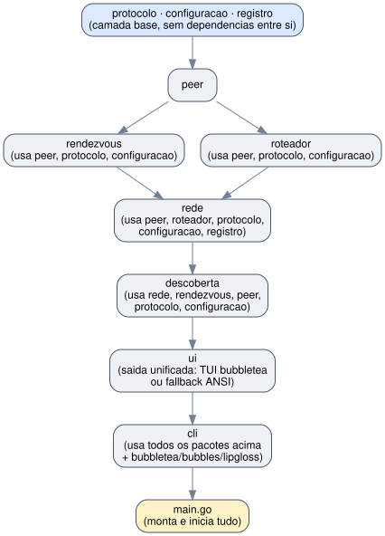
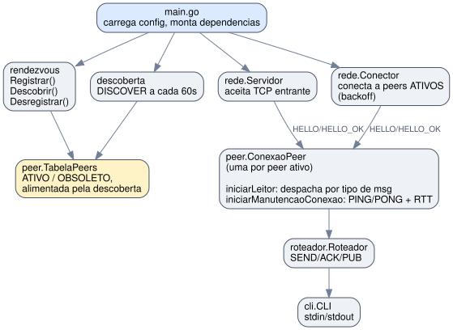

# Cliente de Chat P2P

Projeto da disciplina **Redes de Computadores** do Departamento de Ciencia da Computacao da Universidade de Brasilia. Cliente de chat P2P implementado em Go que registra-se em um servidor Rendezvous, descobre peers automaticamente e mantem conexoes TCP persistentes para troca de mensagens em tempo real (SEND/ACK, PUB, PING/PONG, BYE/BYE_OK).

Codigo-fonte em portugues com tags JSON e literais de protocolo em ingles para interoperabilidade.

> **Servidor Rendezvous:** este cliente depende de um servidor Rendezvous para registro e descoberta de peers. A implementacao de referencia do servidor (fornecida pelo professor) esta disponivel em [mfcaetano/pyp2p-rdv](https://github.com/mfcaetano/pyp2p-rdv). Para testes locais, basta rodar `python3 src/rendezvous/main.py --host 0.0.0.0 --port 8080` (veja a secao [Testando Localmente](#testando-localmente-dois-peers-na-mesma-maquina)).

---

## Sumario

- [Participantes](#participantes)
- [Tecnologias](#tecnologias)
- [Escopo do Projeto](#escopo-do-projeto)
- [Requisitos](#requisitos)
- [Estrutura do Projeto](#estrutura-do-projeto)
- [Compilacao](#compilacao)
- [Configuracao](#configuracao)
- [Como Executar](#como-executar)
- [Testando Localmente](#testando-localmente-dois-peers-na-mesma-maquina)
- [Comandos da CLI](#comandos-da-cli)
- [Interface TUI](#interface-tui)
- [Arquitetura](#arquitetura)
- [Protocolos](#protocolos)
- [Fluxo de Ponta a Ponta](#fluxo-de-ponta-a-ponta-exemplo)
- [Concorrencia](#concorrencia)

---

## Participantes

| Nome                              | Matricula |
|-----------------------------------|-----------|
| Gustavo Vieira de Araujo          | 211068440 |
| Fabio Willian Alves Silva         | 251020487 |
| Joao Francisco de Sousa Torres    | 251037072 |

---

## Tecnologias

| Tecnologia                    | Uso                                                                         |
|-------------------------------|-----------------------------------------------------------------------------|
| Go 1.21+                      | Linguagem de implementacao                                                   |
| TCP                           | Transporte para comunicacao Rendezvous e P2P                                |
| JSON                          | Codificacao de mensagens (delimitado por `\n`, max 32 KiB)                  |
| bubbletea (charmbracelet)     | Framework TUI Elm-like: modelo/update/view, tela alternativa, suporte mouse |
| bubbles (charmbracelet)       | Componentes reutilizaveis: viewport rolavel e campo de texto com historico   |
| lipgloss (charmbracelet)      | Estilizacao e layout: cores 256, colunas com JoinHorizontal, barra de status|

---

## Escopo do Projeto

| Requisito                                          | Implementacao                                                       |
|----------------------------------------------------|---------------------------------------------------------------------|
| Registro no Rendezvous (REGISTER)                  | `rendezvous/cliente.go`: registro com renovacao periodica de TTL    |
| Descoberta de peers (DISCOVER)                     | `descoberta/descoberta.go`: loop automatico a cada 60s              |
| Desregistro (UNREGISTER)                           | `rendezvous/cliente.go`: no `/quit` e SIGINT/SIGTERM                |
| Conexao TCP persistente (HELLO/HELLO_OK)           | `rede/servidor.go` (inbound) + `rede/conector.go` (outbound)        |
| Keep-alive (PING/PONG com RTT)                     | `rede/manutencao.go`: EWMA 0.8/0.2, timeout 10s                    |
| Mensagem direta (SEND/ACK)                         | `roteador/roteador.go`: timeout 5s, confirmacao visivel             |
| Broadcast/namespace-cast (PUB)                     | `roteador/roteador.go`: `*` ou `#namespace`                        |
| Encerramento controlado (BYE/BYE_OK)               | `rede/leitor.go`: resposta automatica + shutdown limpo              |
| Reconexao com backoff exponencial                  | `rede/conector.go`: 1s, 2s, 4s... ate `max_tentativas_reconexao`   |
| TUI interativo com 3 colunas (bubbletea)           | `cli/tui.go`: Comandos / Mensagens / Log, historico, tab-completion  |
| CLI com 7 comandos                                 | `cli/cli.go`: /peers, /msg, /pub, /conn, /reconnect, /help, /quit  |
| Log interno no painel TUI                          | `registro/registro.go` + `ui/ui.go`: logs roteados para coluna Log  |
| Limite de 32 KiB por linha                         | `peer/conexao.go`: rejeita linhas acima do limite                   |
| Validacao de config.json                           | `configuracao/configuracao.go`: fail-fast se nome/namespace/porta invalidos |
| Retry no startup do Rendezvous                     | `main.go`: 5 tentativas com backoff                                 |

---

## Requisitos

- **Sistema operacional**: Linux 64-bit (testado em Ubuntu/Debian; também funciona em macOS e Windows, mas o roteiro do trabalho assume Linux)
- **Go 1.21 ou superior**
- **Conectividade**:
  - Acesso à internet/rede para alcançar o servidor Rendezvous (host e porta definidos em `config.json`)
  - A porta TCP local definida em `porta` (config.json) precisa estar livre e, se houver firewall/NAT entre os peers, liberada/redirecionada para que outros peers consigam abrir conexões de entrada
- **Dependências externas**: `github.com/charmbracelet/bubbletea`, `github.com/charmbracelet/bubbles` e `github.com/charmbracelet/lipgloss` (TUI). O restante usa exclusivamente a biblioteca padrão do Go (`net`, `encoding/json`, `bufio`, `sync`, `time`, `crypto/rand`, etc.). As dependências são gerenciadas por `go.mod` e baixadas automaticamente no primeiro build.

### Instalando o Go (se necessário)

```bash
wget https://go.dev/dl/go1.21.0.linux-amd64.tar.gz
sudo tar -C /usr/local -xzf go1.21.0.linux-amd64.tar.gz
echo 'export PATH=$PATH:/usr/local/go/bin' >> ~/.bashrc
source ~/.bashrc
```

Verifique a instalação:

```bash
go version
# go version go1.21.x linux/amd64
```

---

## Estrutura do projeto

| Diretorio / Arquivo | Descricao |
|---|---|
| `go.mod` | modulo Go: "cliente-p2p" |
| `config.json` | configuracao do peer local (editar antes de rodar) |
| `main.go` | ponto de entrada: inicializacao e wiring de todos os pacotes |
| `protocolo/mensagens.go` | tipos de mensagens trocadas com o Rendezvous e entre peers |
| `configuracao/configuracao.go` | leitura e validacao do config.json |
| `registro/registro.go` | logger com niveis ajustaveis em runtime (DEBUG/INFO/WARN/ERROR) |
| `peer/conexao.go` | `ConexaoPeer`: socket + canais + RTT + ACKs pendentes |
| `peer/gerenciador.go` | `GerenciadorConexoes`: mapa de conexoes ativas (thread-safe) |
| `peer/tabela.go` | `TabelaPeers`: peers conhecidos via Rendezvous (ATIVO/OBSOLETO) |
| `rendezvous/cliente.go` | cliente do protocolo Rendezvous: REGISTER, DISCOVER, UNREGISTER |
| `roteador/roteador.go` | envio/recebimento de mensagens de aplicacao: SEND/ACK, PUB |
| `rede/servidor.go` | aceita conexoes TCP entrantes (handshake HELLO/HELLO_OK) |
| `rede/conector.go` | abre conexoes de saida com peers ativos (backoff exponencial) |
| `rede/leitor.go` | loop de leitura por conexao + despacho por tipo de mensagem |
| `rede/manutencao.go` | keep-alive PING/PONG e calculo de RTT |
| `descoberta/descoberta.go` | descoberta periodica de peers: loop DISCOVER a cada 60s, atualiza TabelaPeers |
| `ui/ui.go` | camada de saida, abstrai TUI e fallback ANSI: MsgUI, EnviarMsg, RegistrarPeer, LogWriter |
| `cli/cli.go` | interface TUI interativa: /peers, /msg, /pub, /conn, /reconnect, /help, /quit |
| `cli/tui.go` | modelo bubbletea: 3 colunas, viewports, estilos lipgloss |

### Grafo de dependências entre pacotes

A organização em pacotes segue uma estrutura em camadas, sem dependências circulares:



---

## Compilação

```bash
go build -o cliente-p2p .
```

Isso gera o binário `cliente-p2p` no diretório atual. As dependências TUI (bubbletea/bubbles/lipgloss) são baixadas automaticamente pelo `go build` na primeira vez; após isso ficam em cache local.

Para verificar que o código está formatado corretamente e sem problemas comuns:

```bash
gofmt -l .     # não deve listar nenhum arquivo
go vet ./...   # não deve reportar nada
```

---

## Configuração

Antes de executar, edite o arquivo `config.json` com os dados do seu peer:

```json
{
  "nome": "teste",
  "namespace": "teste",
  "porta": 4000,
  "ttl": 3600,
  "intervalo_ping_s": 30,
  "max_tentativas_reconexao": 5,
  "endereco_rendezvous": "45.171.101.167",
  "porta_rendezvous": 8080
}
```

| Campo | Tipo | Obrigatório | Padrão (se omitido) | Descrição |
|---|---|---|---|---|
| `nome` | string | sim | - | Nome do peer dentro do namespace. Combinado com `namespace`, forma o identificador completo `nome@namespace` (ex.: `alice@CIC`) |
| `namespace` | string | sim | - | Grupo lógico de peers. Apenas peers do mesmo namespace se descobrem por padrão (`/peers` sem argumentos) |
| `porta` | int | sim | - | Porta TCP local em que o servidor deste peer escuta conexões de entrada de outros peers |
| `ttl` | int | não | `3600` | Tempo de vida (em segundos) do registro deste peer no servidor Rendezvous, enviado no `REGISTER` |
| `intervalo_ping_s` | int | não | `30` | Intervalo, em segundos, entre os `PING` de keep-alive enviados em cada conexão P2P ativa |
| `max_tentativas_reconexao` | int | não | `5` | Número máximo de tentativas (com backoff exponencial: 1s, 2s, 4s, ...) ao tentar conectar a um peer descoberto |
| `endereco_rendezvous` | string | não | `pyp2p.mfcaetano.cc` | Hostname ou IP do servidor Rendezvous |
| `porta_rendezvous` | int | não | `8080` | Porta TCP do servidor Rendezvous |
| `arquivo_log` | string | não | `""` (desativado) | Caminho do arquivo de log. Se preenchido, todos os eventos são gravados simultaneamente em stderr e no arquivo (modo append). Útil para inspecionar sessões após o encerramento |

> A identidade completa do peer (`MeuID()` no código) é sempre `nome@namespace`, por exemplo, `alice@CIC`. É esse identificador que aparece em `/peers`, `/conn`, `/msg`, etc.

Para rodar múltiplos peers na mesma máquina (para teste local), crie um `config.json` por peer com `nome` e `porta` diferentes (veja [config_0.json](config_0.json) e [config_1.json](config_1.json), usados na seção [Testando localmente](#testando-localmente-dois-peers-na-mesma-máquina)).

---

## Execução

Com o `config.json` no mesmo diretório do binário:

```bash
./cliente-p2p
```

Para usar um arquivo de configuração com outro nome/local:

```bash
./cliente-p2p -config config-bob.json
```

### Interface na inicialização

Ao iniciar, o terminal entra em tela alternativa com o TUI de 3 colunas:

```
 P2P Chat - alice@CIC - porta 4000                          0 conectado(s)
─────────────────────────────────────────────────────────────────────────
 Comandos                    │ Mensagens                    │ Log

>
─────────────────────────────────────────────────────────────────────────
> /help para listar comandos · ↑↓ histórico · Tab autocompleta · PgUp/PgDn rola
```

A coluna **Comandos** (esquerda) exibe a saída de `/peers`, `/conn`, `/help` e confirmações. A coluna **Mensagens** (centro) exibe mensagens SEND e PUB recebidas e enviadas. A coluna **Log** (direita) exibe eventos de sistema (conexão, desconexão, tentativas de reconexão) e os logs internos do cliente. O campo `>` na parte inferior aceita os comandos a qualquer momento.

### Encerrando o programa

Use `/quit` ou pressione `Ctrl+C` (SIGINT/SIGTERM). Em ambos os casos o cliente:

1. Envia `BYE` para cada peer com conexão ativa e aguarda `BYE_OK` (até 2s por peer);
2. Envia `UNREGISTER` ao servidor Rendezvous, removendo o registro deste peer;
3. Encerra o processo.

---

## Testando localmente (dois peers na mesma máquina)

Para validar a comunicação P2P (handshake, PING/PONG, SEND/ACK, PUB, BYE) sem depender de outra máquina/rede, é preciso que **os dois peers fiquem registrados com o mesmo IP de origem**; caso contrário, ao tentar discar de volta para o IP público do servidor Rendezvous a partir da própria máquina, ocorrem problemas de *NAT hairpin*. A solução é apontar ambos os clientes para um servidor Rendezvous **rodando localmente**: como ele enxerga a conexão TCP de cada cliente vindo de `127.0.0.1`, registra os dois peers com `ip: "127.0.0.1"`, permitindo que o `DISCOVER` resolva o endereço do outro peer para `127.0.0.1:<porta>` e a conexão P2P aconteça via loopback.

### 1. Suba o servidor Rendezvous de referência localmente

O repositório de referência `pyp2p-rdv` (irmão deste projeto) traz uma implementação do servidor Rendezvous em Python (stdlib apenas, sem dependências):

```bash
cd ../pyp2p-rdv/src/rendezvous
python3 main.py --host 127.0.0.1 --port 8080
```

Deixe esse processo rodando em um terminal: ele loga cada `REGISTER`/`DISCOVER`/`UNREGISTER` recebido.

### 2. Use os arquivos de configuração de exemplo

Crie dois arquivos de configuração com o mesmo `namespace` (`"teste"`), nomes e portas diferentes (4000/4001), ambos apontando `endereco_rendezvous`/`porta_rendezvous` para `127.0.0.1:8080`:

```json
{
  "nome": "teste_0",
  "namespace": "teste",
  "porta": 4000,
  "ttl": 3600,
  "intervalo_ping_s": 30,
  "max_tentativas_reconexao": 5,
  "endereco_rendezvous": "127.0.0.1",
  "porta_rendezvous": 8080
}
```

### 3. Rode os dois peers em terminais separados

```bash
# terminal 2
./cliente-p2p -config config_0.json

# terminal 3
./cliente-p2p -config config_1.json
```

### 4. Verifique a descoberta e troque mensagens

No prompt da `teste_0`:

```
> /peers
  teste_1@teste  127.0.0.1:4001  expira_em=3599s [conectado]
```

A descoberta automática (a cada 60s) já dispara a conexão P2P sozinha, mas `/reconnect` força isso imediatamente. Depois de conectados:

```
> /conn
  teste_1@teste  (saida)  rtt=0.4ms

> /msg teste_1@teste ola, aqui eh o teste_0
[ACK de teste_1@teste: mensagem confirmada]

> /pub * mensagem para todo mundo
```

No terminal do `teste_1` a mensagem direta e o broadcast aparecem automaticamente, sem precisar de comando.

> **Nota:** os comandos acima usam `127.0.0.1`, então **não funcionam** se `config_0.json`/`config_1.json` apontarem para o servidor Rendezvous público (`45.171.101.167:8080`), já que nesse caso o servidor veria ambos os clientes chegando do mesmo IP público, mas cada um tentaria discar de volta para esse IP público (e não para `127.0.0.1`), o que normalmente falha por NAT hairpin/loopback bloqueado.

---

## Comandos da CLI

| Comando | Descrição |
|---|---|
| `/peers` | Executa `DISCOVER` no Rendezvous e lista os peers do **mesmo namespace** configurado |
| `/peers *` | Lista peers de **todos** os namespaces |
| `/peers #<namespace>` | Lista peers de um namespace específico (ex.: `/peers #ECO`) |
| `/msg <peer_id|numero> <mensagem>` | Envia uma mensagem direta (`SEND`) para `<peer_id>` ou pelo número de atalho, exigindo confirmação (`ACK`) |
| `/pub * <mensagem>` | Envia uma mensagem de broadcast (`PUB`) para **todas** as conexões ativas |
| `/pub #<namespace> <mensagem>` | Envia `PUB` apenas para conexões cujo peer pertence a `<namespace>` |
| `/conn` | Lista as conexões P2P ativas, direção (`entrada`/`saida`), IP, tempo conectado e RTT |
| `/reconnect` | Executa `DISCOVER` e força reconciliação imediata com todos os peers ativos |
| `/help` | Exibe tabela de comandos com sintaxe e exemplos na coluna Comandos |
| `/quit` | Envia `BYE`/aguarda `BYE_OK` de cada peer, desregistra do Rendezvous e encerra o TUI |

`peer_id` sempre tem o formato `nome@namespace`, exatamente como exibido por `/peers` e `/conn`. Os números de atalho (`[1]`, `[2]`...) são atribuídos na ordem em que os peers aparecem e persistem durante a sessão. Tab autocompleta IDs após `/msg`.

---

## Interface TUI

O cliente usa [bubbletea](https://github.com/charmbracelet/bubbletea) com tela alternativa (`tea.WithAltScreen()`), dividida em três colunas e uma barra de status fixa:

```
 P2P Chat - alice@CIC - porta 4000                          3 conectado(s)
─────────────────────────────────────────────────────────────────────────
 Comandos                    │ Mensagens                    │ Log
                             │                              │
 ─ /peers ────────────────   │  10:12 [1] bob@CIC: oi!     │  10:12 * [1] bob@CIC conectou
 [1] bob@CIC  127.0.0.1:4001 │  10:13 você → [1] bob: ola  │  10:12 * [2] carol@CIC conectou
 [2] carol@CIC 127.0.0.1:4002│                              │  [WARN] Conector: tentativa 1/5
 Use /msg <numero> ...        │                              │
─────────────────────────────────────────────────────────────────────────
> /msg 1 ola
```

### Roteamento de mensagens por coluna

| Tipo de mensagem | Coluna |
|---|---|
| Saída de comandos (`/peers`, `/conn`, `/help`, `/reconnect`, `/pub`) | **Comandos** (esquerda) |
| Separador de comando (`─ /peers ──────`) | **Comandos** (esquerda); não aparece em caso de erro |
| Mensagens recebidas (SEND, PUB) e enviadas | **Mensagens** (centro) |
| Eventos de sistema (conexão, desconexão, ACK, falha) | **Log** (direita) |
| Logs internos (WARN, ERROR do pacote `registro`) | **Log** (direita) |
| Erros de comando (argumento inválido, peer não encontrado) | **Log** (direita) |

### Atalhos de teclado

| Tecla | Ação |
|---|---|
| `Enter` | Executa o comando digitado |
| `↑` / `↓` | Navega no histórico de comandos |
| `Tab` | Autocompleta comandos e IDs de peer (cicla entre candidatos) |
| `PgUp` / `PgDn` | Rola a coluna Mensagens |
| `Ctrl+C` | Encerramento limpo (BYE + UNREGISTER) |

---

## Arquitetura

### Visão geral por pacote

| Pacote | Responsabilidade |
|---|---|
| `protocolo` | Define todas as structs de mensagens (Rendezvous e P2P) e a função `GerarIDMensagem()` (UUID v4 para `msg_id`) |
| `configuracao` | Struct `Configuracao`, função `CarregarConfiguracao` (lê `config.json` e aplica padrões) e `MeuID()` |
| `registro` | Logger com níveis (`Depurar`, `Informar`, `Alertar`, `Erro`) e `DefinirNivel` para alterar o nível; `SilenciarTerminal` redireciona saída para o TUI |
| `peer` | `ConexaoPeer` (uma conexão TCP + canais + RTT + ACKs pendentes), `GerenciadorConexoes` (mapa de conexões ativas) e `TabelaPeers` (peers conhecidos via Rendezvous) |
| `rendezvous` | `ClienteRendezvous`: `Registrar`, `Descobrir`, `Desregistrar` (uma conexão TCP nova por comando) e `IniciarRenovacaoPeriodica`, que renova o registro (TTL) periodicamente |
| `roteador` | `Roteador`: `Enviar` (SEND+ACK), `Publicar` (PUB), `TratarMensagemRecebida`, `TratarPublicacaoRecebida` |
| `rede` | `Servidor` (aceita conexões entrantes + handshake), `Conector` (abre conexões de saída + backoff), funções internas `iniciarLeitor` (loop de leitura/despacho) e `iniciarManutencaoConexao` (PING/PONG), e `EnviarTchau` (BYE/BYE_OK) |
| `descoberta` | `IniciarLoopDescoberta`: chama `Descobrir` a cada 60s e atualiza a `TabelaPeers` |
| `ui` | Camada de saída unificada: `MsgUI`, `EnviarMsg` (roteia ao TUI ou fallback ANSI), `RegistrarPeer`/`ResolverPeer` (numeração de peers) e `LogWriter` (io.Writer que envia linhas para a coluna Log) |
| `cli` | TUI bubbletea de 3 colunas (`tui.go`) + processamento de comandos (`cli.go`) |
| `main` | Monta as dependências e inicia tudo |

### Fluxo de dados



---

## Protocolos

### Rendezvous (uma conexão TCP nova por comando, implementado em `rendezvous/cliente.go`)

**REGISTER**, executado uma vez na inicialização (`main.go` → `rdv.Registrar()`):

```
→ {"type":"REGISTER","namespace":"CIC","name":"alice","port":4000,"ttl":3600}
← {"status":"OK","ttl":3600,"ip":"200.1.2.3","port":4000}
```

**DISCOVER**, executado a cada 60s pelo pacote `descoberta` e também pelo comando `/peers`:

```
→ {"type":"DISCOVER","namespace":"CIC"}
← {"status":"OK","peers":[{"ip":"200.1.2.4","port":4001,"name":"bob","namespace":"CIC","expires_in":3412}]}
```

Se `namespace` for omitido, o servidor retorna peers de todos os namespaces (usado por `/peers *`).

**UNREGISTER**, executado no `/quit` e no SIGINT/SIGTERM (`cli.comandoSair` / handler de sinal em `main.go`):

```
→ {"type":"UNREGISTER","namespace":"CIC","name":"alice","port":4000}
← {"status":"OK"}
```

**Renovação periódica do registro (REGISTER)**: para sessões mais longas que `ttl`, `rendezvous.ClienteRendezvous.IniciarRenovacaoPeriodica` (iniciada em goroutine própria por `main.go`) reenvia o mesmo `REGISTER` periodicamente, evitando que o registro expire e seja descartado pelo servidor. O intervalo é `ttl/2` (ou `ttl-60`, o que for menor), com variação aleatória de ±10%; em caso de falha, tenta novamente com backoff exponencial (5s, 10s, 20s, ... até 60s).

---

### P2P entre peers (conexão TCP persistente, implementado em `rede/` e `peer/`)

**HELLO / HELLO_OK**, handshake ao estabelecer a conexão (`rede.Servidor.tratarConexaoEntrante` / `rede.Conector.conectarAoPeer`):

```
→ {"type":"HELLO","peer_id":"alice@CIC","version":"1.0","features":["ack","metrics"],"ttl":1}
← {"type":"HELLO_OK","peer_id":"bob@CIC","version":"1.0","features":["ack","metrics"],"ttl":1}
```

**PING / PONG**, keep-alive a cada `intervalo_ping_s` segundos (`rede/manutencao.go`):

```
→ {"type":"PING","msg_id":"a1b2-...","timestamp":"2026-06-13T10:00:00Z","ttl":1}
← {"type":"PONG","msg_id":"a1b2-...","timestamp":"2026-06-13T10:00:00Z","ttl":1}
```

O RTT é calculado com média móvel exponencial em `ConexaoPeer.AtualizarRTT`: `rttMedio = 0.8 × rttMedio + 0.2 × rttNovo`. Se o `PONG` correspondente não chegar em 10 segundos, a conexão é encerrada.

**SEND / ACK**, mensagem direta com confirmação (`roteador.Enviar`, processado em `rede/leitor.go`):

```
→ {"type":"SEND","msg_id":"e5f6-...","src":"alice@CIC","dst":"bob@CIC","payload":"oi!","require_ack":true,"ttl":1}
← {"type":"ACK","msg_id":"e5f6-...","timestamp":"2026-06-13T10:00:01Z","ttl":1}
```

Se o `ACK` não chegar em 5 segundos, um aviso é registrado no log e a espera é cancelada.

**PUB**, broadcast/namespace-cast sem confirmação (`roteador.Publicar`):

```
→ {"type":"PUB","msg_id":"g7h8-...","src":"alice@CIC","dst":"#CIC","payload":"reunião às 14h","require_ack":false,"ttl":1}
→ {"type":"PUB","msg_id":"i9j0-...","src":"alice@CIC","dst":"*","payload":"aviso global","require_ack":false,"ttl":1}
```

**BYE / BYE_OK**, encerramento controlado de uma conexão (`rede.EnviarTchau`, processado em `rede/leitor.go`):

```
→ {"type":"BYE","msg_id":"k1l2-...","src":"alice@CIC","dst":"bob@CIC","reason":"encerrando sessão","ttl":1}
← {"type":"BYE_OK","msg_id":"k1l2-...","src":"bob@CIC","dst":"alice@CIC","ttl":1}
```

---

## Fluxo de ponta a ponta (exemplo)

Exemplo com dois peers: **alice** (`200.1.2.3:4000`, `config.json` com `nome="alice"`) e **bob** (`200.1.2.4:4001`, `config.json` com `nome="bob"`), ambos com `namespace="CIC"`.

### 1. Inicialização e registro

Ambos iniciam (`./cliente-p2p`) e executam `REGISTER` no Rendezvous de forma independente. Em seguida, o `descoberta.IniciarLoopDescoberta` de cada um executa um `DISCOVER` imediatamente e depois a cada 60 segundos:

```
alice → rendezvous: REGISTER (nome=alice, namespace=CIC, porta=4000)
bob   → rendezvous: REGISTER (nome=bob,   namespace=CIC, porta=4001)

alice → rendezvous: DISCOVER (namespace=CIC) → recebe [bob@CIC]
bob   → rendezvous: DISCOVER (namespace=CIC) → recebe [alice@CIC]
```

Ambos atualizam sua `peer.TabelaPeers` marcando o outro peer como `EstadoAtivo` (`ATIVO`).

### 2. Estabelecimento da conexão P2P

O `rede.Conector` de cada peer roda em uma goroutine própria e, a cada reconciliação (30s, ou imediatamente via `/reconnect` ou `Disparar()`), verifica na `TabelaPeers` quais peers `ATIVO` ainda não têm conexão em `GerenciadorConexoes`. Suponha que bob conecte primeiro:

```
bob  ──TCP CONNECT──► alice:4000

bob   → alice: {"type":"HELLO","peer_id":"bob@CIC","version":"1.0","features":["ack","metrics"],"ttl":1}
alice → bob:   {"type":"HELLO_OK","peer_id":"alice@CIC","version":"1.0","features":["ack","metrics"],"ttl":1}
```

Após o handshake:
- `alice` registra a conexão com `bob@CIC` como `peer.DirecaoEntrada` ("entrada") em seu `GerenciadorConexoes`;
- `bob` registra a conexão com `alice@CIC` como `peer.DirecaoSaida` ("saida") no seu.

Para cada conexão são iniciadas duas goroutines: `rede.iniciarLeitor` (loop de leitura e despacho por tipo de mensagem) e `rede.iniciarManutencaoConexao` (keep-alive PING/PONG).

### 3. Keep-alive e RTT

A goroutine de manutenção de bob envia `PING` a cada `intervalo_ping_s` (30s por padrão):

```
bob   → alice: {"type":"PING","msg_id":"uuid-1","timestamp":"..."}
alice → bob:   {"type":"PONG","msg_id":"uuid-1","timestamp":"..."}
```

RTT medido: `43ms`. `ConexaoPeer.AtualizarRTT(43)` define `rttMedio = 43.0` (primeira medição). Visível com `/rtt`:

```
> /rtt
  bob@CIC: RTT médio = 43.0 ms
```

### 4. Mensagem direta (SEND/ACK)

Bob digita `/msg alice@CIC oi alice!`. `cli.comandoMsg` chama `roteador.Enviar`:

```
bob   → alice: {"type":"SEND","msg_id":"uuid-2","src":"bob@CIC","dst":"alice@CIC","payload":"oi alice!","require_ack":true,"ttl":1}
```

`rede.iniciarLeitor` de alice recebe a mensagem e chama `roteador.TratarMensagemRecebida`, que imprime:

```
[bob@CIC -> voce]: oi alice!
```

e responde automaticamente com `ACK`:

```
alice → bob: {"type":"ACK","msg_id":"uuid-2","timestamp":"..."}
```

`ConexaoPeer.ConfirmarRecebimento("uuid-2")` em bob sinaliza o canal de espera, cancelando o timer de timeout de 5s criado por `roteador.Enviar`, e imprime no terminal de bob:

```
[ACK de alice@CIC: mensagem confirmada]
```

### 5. Broadcast (PUB)

Alice digita `/pub #CIC reunião cancelada`. `cli.comandoPub` chama `roteador.Publicar("#CIC", "reunião cancelada")`, que envia a mensagem em todas as conexões cujo `IDPeer` pertence ao namespace `CIC`:

```
alice → bob: {"type":"PUB","msg_id":"uuid-3","src":"alice@CIC","dst":"#CIC","payload":"reunião cancelada","require_ack":false,"ttl":1}
```

`roteador.TratarPublicacaoRecebida` em bob imprime:

```
[PUB #CIC <- alice@CIC]: reunião cancelada
```

### 6. Reconexão automática

Se a conexão TCP entre alice e bob cair (rede instável, processo morto):

1. `rede.iniciarLeitor` detecta erro de leitura, chama `gerenciador.Remover(idPeer)` e `conexao.Fechar()` (fecha `CanalEncerramento` via `sync.Once`);
2. `rede.iniciarManutencaoConexao` detecta `CanalEncerramento` fechado e termina;
3. Na próxima reconciliação do `rede.Conector` (até 30s, ou imediatamente após `/peers` ou `/reconnect`, que chamam `conector.Disparar()`), o peer remoto continua `ATIVO` na `TabelaPeers` mas sem conexão em `GerenciadorConexoes`;
4. `conector.conectarAoPeer` tenta novamente com backoff exponencial: 1s → 2s → 4s → ... até `max_tentativas_reconexao` tentativas.

### 7. Encerramento

Alice digita `/quit`. `cli.comandoSair` chama `rede.EnviarTchau` para cada conexão ativa:

```
alice → bob: {"type":"BYE","msg_id":"uuid-4","src":"alice@CIC","dst":"bob@CIC","reason":"encerrando sessão","ttl":1}
bob   → alice: {"type":"BYE_OK","msg_id":"uuid-4","src":"bob@CIC","dst":"alice@CIC","ttl":1}
```

`rede.iniciarLeitor` de bob, ao receber `BYE`, responde com `BYE_OK`, imprime `[alice@CIC encerrou a sessão]` e remove a conexão do `GerenciadorConexoes`. Em seguida, alice executa:

```
alice → rendezvous: UNREGISTER (nome=alice, namespace=CIC, porta=4000)
```

e o processo é finalizado (`os.Exit(0)`).

---

## Concorrência

Cada conexão ativa roda duas goroutines independentes (`iniciarLeitor` e `iniciarManutencaoConexao`), além das goroutines globais do conector (`rede.Conector.Iniciar`) e da descoberta periódica (`descoberta.IniciarLoopDescoberta`). O acesso a estado compartilhado é protegido pelas seguintes primitivas do pacote `sync`:

| Primitiva | Onde é usada | Motivo |
|---|---|---|
| `sync.RWMutex` | `peer.GerenciadorConexoes.mutex`, `peer.TabelaPeers.mutex` | Permite múltiplas leituras simultâneas (`/peers`, `/conn`, reconciliação) e exclusão mútua em escritas |
| `sync.Mutex` | `ConexaoPeer.mutexEscrita` (escrita serializada no socket), `ConexaoPeer.mutexConfirmacao` (mapa de ACKs pendentes), `Conector.mutexConectando` (mapa de tentativas em andamento) | Evita corrupção por escritas/leituras concorrentes em mapas e no socket |
| `sync.RWMutex` | `ConexaoPeer.mutexRTT` | Protege `rttMedio`, atualizado pela goroutine de manutenção e lido por `/rtt` e `/conn` |
| `sync.Once` | `ConexaoPeer.fecharUmaVez` (usado em `Fechar()`) | Garante que o socket é fechado e `CanalEncerramento` é fechado exatamente uma vez, mesmo com `iniciarLeitor`, `iniciarManutencaoConexao` e o tratamento de `/quit`/SIGINT chamando `Fechar()` concorrentemente |
| `chan protocolo.MensagemPong` | `ConexaoPeer.CanalPong` | Entrega o `PONG` lido por `iniciarLeitor` para `iniciarManutencaoConexao`, sem memória compartilhada |
| `chan struct{}` | `ConexaoPeer.CanalEncerramento` | Fechado por `Fechar()`; sinaliza todas as goroutines associadas à conexão para que terminem |
| `chan struct{}` | `ConexaoPeer.CanalConfirmacaoBye` | Sinaliza `EnviarTchau` quando o `BYE_OK` correspondente é recebido por `iniciarLeitor` |
| `chan struct{}` (mapa `esperasConfirmacao`) | `ConexaoPeer.RegistrarEsperaConfirmacao` / `ConfirmarRecebimento` | Sinaliza `roteador.Enviar` quando o `ACK` de uma mensagem `SEND` é recebido |
| `chan struct{}` | `Conector.canalDisparo` | Permite que `/peers`, `/reconnect` e a `descoberta` disparem uma reconciliação imediata sem bloquear se já houver uma pendente |

A regra seguida é a do próprio Go: *não compartilhe memória para comunicar; comunique para compartilhar memória*.

---

> Documentacao gerada com auxilio de IA.
